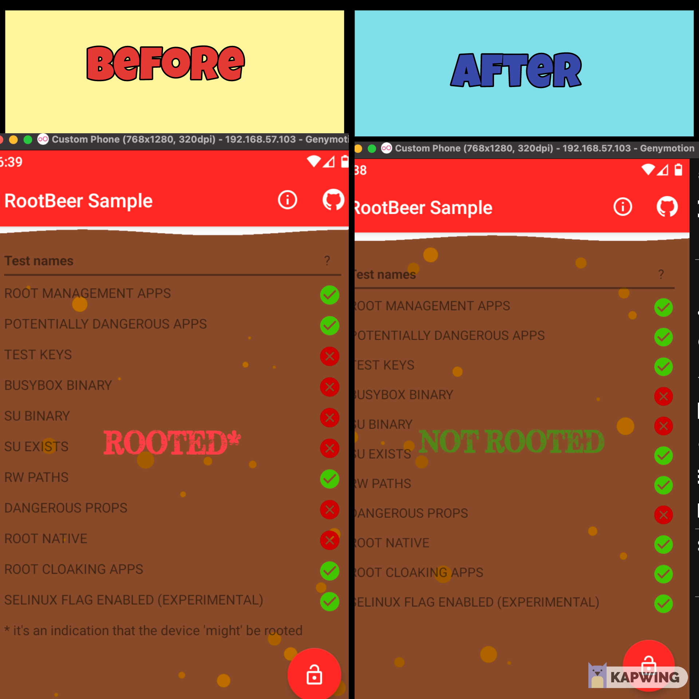

# Foobar

RootBeer Bypass Tools




## Usage

```python
python rbbt.py --path /folder/decompiled/apk
```

## Contributing
Pull requests are welcome. For major changes, please open an issue first to discuss what you would like to change.

Please make sure to update tests as appropriate.

## License
[MIT](https://choosealicense.com/licenses/mit/)